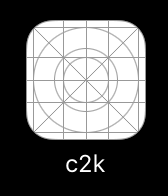

# count2k (c2k)

`c2k` is a tool that generates a custom goal tracking app from a simple javscript function. For instance, let's say I wanted an app that tracked the number of Meetup's I've RSVPed for in my lifetime, with a goal of hitting 200:

<br>


First, I need a function to fetch my Meetup RSVP count: 

```javascript
var request = require('request')
var apiKey = '705b514f2dd7a6ff57e2c1a31203e63'

request({ 
    url: 'https://api.meetup.com/members/self',
    method: 'GET',
    json: true,
    qs: { 
        'photo-host': 'public',
        fields: 'stats',
        page: 20,
        key: apiKey,
        json: true
    }
}, function (err, resp, data) { 
    if (err) { return process.exit(-1) }
    console.log(data.stats.rsvps)
})
```

Then write some JSON to describe the goal counter:

```javascript
{
  "title": "Meetup RSVPs",
  "max": 200,
  "color": { 
    "red": 0.7,
    "green": 0.2,
    "blue": 0.2
  }
}
```

`c2k` compiles this JSON + function into an app I can load on my phone:




# Getting Started

To use this tool you must have a Mac with Xcode installed and setup for iOS development. You can test the tool locally with the iOS simulator. You can also deploy your counter as a server component to a remove VM and install the iOS app to your own device.

## Install the tool

    $ git clone https://github.com/jkingyens/c2k.git && cd c2k
    $ npm install -g

## create a counter

A counter will live in a new empty directory:

    $ mkdir mycounter && cd mycounter

There are two files you need to create, `counter.json` and `counter.js`

### counter.js 

This is basically a node.js program **that uses the request module only.** The general structure looks something like this:

```javascript
let request = require('request')
...
...
request({ 

}, function (err, resp, body) { 

    ...
    process.stdout('...')
    
}
```

The javascript function should simply print the value it's observering on `stdout` and quit.

If the fetching errors, you should return non-zero exit from the process (see meetup example above)

### counter.json 

This describes the counter ring itself. You are required to specify all values:

```javascript
{
  "title": "Meetup RSVPs",
  "max": 200,
  "color": { 
    "red": 0.7,
    "green": 0.2,
    "blue": 0.2
  }
}
```

# Testing with Simulator

To build the ring app for testing purposes, simply run `c2k` at the command line:

    $ c2k
    
Running this command will produce an `output` folder with a `server` and `ios` component:

    $ cd output && ls -l
    total 8
    drwxr-xr-x   6 jkingyens  staff  204 May 21 17:07 ios
    -rw-r--r--   1 jkingyens  staff  997 May 21 17:07 raw.json
    drwxr-xr-x  11 jkingyens  staff  374 May 21 17:07 server

To start the server locally, install [Docker for Mac](https://store.docker.com/editions/community/docker-ce-desktop-mac?tab=description) and then run the shell command in `start.cmd`:

    $ cd server
    $ sh start.cmd

This will spin up the server using `docker-compose` on `127.0.0.1` port `3000`, you can check it out:

    $ docker ps
    CONTAINER ID        IMAGE               COMMAND             CREATED             STATUS              PORTS                    NAMES
    96af1242c5f0        server_c2k          "npm start"         29 minutes ago      Up 29 minutes       0.0.0.0:3000->3000/tcp   server_c2k_1

Now, make sure you have Xcode development tools installed for Mac. Then, load `c2k.xcodeproj` from the `ios` component in Xcode IDE: 

    $ cd ../ios
    $ open c2k.xcodeproj

From the IDE build & run the project on a simulated device:


Verify that your counter loads with the correct counter title, color, maximum count, as well as current value. It should look something like this: 


If everything looks good you can try deploying remotely:

# Device Deployment

## server
The big difference here is that you must run the build tool with the ip address and port that the server component will be accessible from on the internet, for example:

    $ c2k 192.241.219.72 3000

This tells the build tool to generate a deployment script that will bind the docker container to the right public port (in this case, 3000) and also tell the iOS component to connect with the server over this ip and port. Connection between the ios and server component is secured using basic http auth and a password/token generated at build time.

To deploy remotely, transfer the `server` component to your remote machine:

    $ scp -r ./output/server root@192.241.219.72:
    
Login to the remote machine, ensure docker is installed (with docker-compose) and run start.cmd: 

    $ ssh root@192.241.219.72
    root@remote$ cd server && sh start.cmd

Docker server should now be running here, just like in testing:

    root@remote:~/server# docker ps
    CONTAINER ID        IMAGE               COMMAND             CREATED             STATUS              PORTS                    NAMES
    231066a1102e        server_c2k          "npm start"         59 seconds ago      Up 58 seconds       0.0.0.0:3000->3000/tcp   server_c2k_1

You may have a firewall on this machine since its exposed to the public, ensure the c2k port is open:

    root@remote:~/server# ufw allow 3000
    Rule added
    Rule added (v6)
    root@remote:~/server# 

## ios app

On the iOS side, it is just a matter of selecting your hardware device instead of the emulator in Xcode tools. The tools will complain about signing your app. Follow it's advice by selecting automatically managing key signing and then create/select your Apple developer profile. This will automatically generate the signing keys and enable you to deploy your app on a limited number of hardware devices. 

Now, from your iOS device, run the "c2k" app from the home screen: 


To see the latest values, kill the app and restart it. Working on pull to fetch next ;) 

# Happy Counting!


Copyright 2017 Jeff Kingyens

Permission is hereby granted, free of charge, to any person obtaining a copy of this software and associated documentation files (the "Software"), to deal in the Software without restriction, including without limitation the rights to use, copy, modify, merge, publish, distribute, sublicense, and/or sell copies of the Software, and to permit persons to whom the Software is furnished to do so, subject to the following conditions:

The above copyright notice and this permission notice shall be included in all copies or substantial portions of the Software.

THE SOFTWARE IS PROVIDED "AS IS", WITHOUT WARRANTY OF ANY KIND, EXPRESS OR IMPLIED, INCLUDING BUT NOT LIMITED TO THE WARRANTIES OF MERCHANTABILITY, FITNESS FOR A PARTICULAR PURPOSE AND NONINFRINGEMENT. IN NO EVENT SHALL THE AUTHORS OR COPYRIGHT HOLDERS BE LIABLE FOR ANY CLAIM, DAMAGES OR OTHER LIABILITY, WHETHER IN AN ACTION OF CONTRACT, TORT OR OTHERWISE, ARISING FROM, OUT OF OR IN CONNECTION WITH THE SOFTWARE OR THE USE OR OTHER DEALINGS IN THE SOFTWARE.