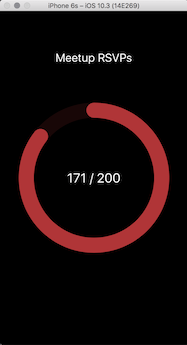
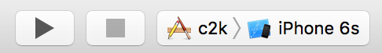

# count2k (c2k)

`c2k` is a tool that generates a custom goal tracking app from a simple javscript function. For instance, let's say I wanted an app that tracked the number of Meetup's I've RSVPed for in my lifetime, with a goal of hitting 200:

<br>




First, I need a function to fetch my Meetup RSVP count: 

```javascript
var request = require('request')
var apiKey = '705b514f2dd7a6ff57e2c1a31203e63'

request({ 
    url: 'https://api.meetup.com/members/self',
    method: 'GET',
    json: true,
    qs: { 
        'photo-host': 'public',
        fields: 'stats',
        page: 20,
        key: apiKey,
        json: true
    }
}, function (err, resp, data) { 
    if (err) { return process.exit(-1) }
    console.log(data.stats.rsvps)
})
```

Then write some JSON to describe the goal counter:

```javascript
{
  "title": "Meetup RSVPs",
  "max": 200,
  "color": { 
    "red": 0.7,
    "green": 0.2,
    "blue": 0.2
  }
}
```

`c2k` then transforms these files into the resulting app in the screenshot above.

# Getting Started

To use this tool you must have a Mac with Xcode installed and setup for iOS development. You can test the tool locally with the iOS simulator. You can also deploy your counter as a server component to a remove VM and install the iOS app to your own device.

## Install the tool

    $ git clone https://github.com/jkingyens/c2k.git && cd c2k
    $ npm install -g

If you want to test your counter functionality locally I recommend installing [Docker for Mac](https://store.docker.com/editions/community/docker-ce-desktop-mac?tab=description) and [docker-compose](https://github.com/docker/compose/releases). `c2k` will output a server component that deploys out-of-the-box with these tools.

## create a counter

A counter will live in a new empty directory:

    $ mkdir mycounter && cd mycounter

There are two files you need to create, `counter.json` and `counter.js`

## counter.js 

This is basically a node.js program **that uses the request module only.** The general structure looks something like this:

```javascript
let request = require('request')
...
...
request({ 

}, function (err, resp, body) { 

    ...
    process.stdout('...')
    
}
```

The javascript function should simply print the value it's observering on `stdout` and quit.

If the fetching errors, you should return non-zero exit from the process (see meetup example above)

## counter.json 

This describes the counter ring itself. You are required to specify all values:

```javascript
{
  "title": "Meetup RSVPs",
  "max": 200,
  "color": { 
    "red": 0.7,
    "green": 0.2,
    "blue": 0.2
  }
}
```

# Local Testing

To test that your counter works locally, ensure you have Docker for Mac installed and `docker-compose` is usable at the commandline. Now do this from your counter path:

    $ c2k
    $ cd output/server
    $ sh start.cmd

This will deploy the c2k server on `127.0.0.1` port `3000`, you can check it out:

    $ docker ps
    CONTAINER ID        IMAGE               COMMAND             CREATED             STATUS              PORTS                    NAMES
    96af1242c5f0        server_c2k          "npm start"         29 minutes ago      Up 29 minutes       0.0.0.0:3000->3000/tcp   server_c2k_1

Now, load `output\ios\c2k.xcodeproj` in Xcode IDE: 

    $ cd ../ios
    $ open c2k.xcodeproj

From the IDE build & run the project on a simulated device:



Verify that your counter loads with the correct counter title, color, maximum count, as well as current value. If everything looks good you can try deploying remotely:

# Remote Deploy

There are only two differences about deploying remotely vs. testing locally:

1. `c2k` needs to bake the remote ip address of your server into the iOS app so it knows where to fetch
2. You need to sign the app and install onto a real device instead of emulator
    * This will require a provisioning profile
    * Check the box "Automatically Manage Signing" to make things easier

Re-build the app by providing the `host` and `port` to `c2k` as CLI args:

    $ c2k 192.241.219.72 3000

This will generate a version of the server that binds to the port specificed here when starting from Docker on the remote machine. It will also generate a version of the iOS app that connects directly with the remote machine ip. Connection between them is negotationed with basic http auth.

To deploy remotely, copy everything in `server` to your remote machine:

    $ scp -r ./output/server root@192.241.219.72:
    $ ssh root@192.241.219.72
    root@remote$ cd server && sh start.cmd

Docker server should now be running here, just like in testing:

    root@remote:~/server# docker ps
    CONTAINER ID        IMAGE               COMMAND             CREATED             STATUS              PORTS                    NAMES
    231066a1102e        server_c2k          "npm start"         59 seconds ago      Up 58 seconds       0.0.0.0:3000->3000/tcp   server_c2k_1

Ensure your firewall is open on the port the service is bound to:

    root@remote:~/server# ufw allow 3000
    Rule added
    Rule added (v6)
    root@remote:~/server# 

Now, from your iOS device, run the "c2k" app from the home screen: 


To see the latest values, kill the app and restart it. Working on pull to fetch next ;) 

# Happy Counting!


Copyright 2017 Jeff Kingyens

Permission is hereby granted, free of charge, to any person obtaining a copy of this software and associated documentation files (the "Software"), to deal in the Software without restriction, including without limitation the rights to use, copy, modify, merge, publish, distribute, sublicense, and/or sell copies of the Software, and to permit persons to whom the Software is furnished to do so, subject to the following conditions:

The above copyright notice and this permission notice shall be included in all copies or substantial portions of the Software.

THE SOFTWARE IS PROVIDED "AS IS", WITHOUT WARRANTY OF ANY KIND, EXPRESS OR IMPLIED, INCLUDING BUT NOT LIMITED TO THE WARRANTIES OF MERCHANTABILITY, FITNESS FOR A PARTICULAR PURPOSE AND NONINFRINGEMENT. IN NO EVENT SHALL THE AUTHORS OR COPYRIGHT HOLDERS BE LIABLE FOR ANY CLAIM, DAMAGES OR OTHER LIABILITY, WHETHER IN AN ACTION OF CONTRACT, TORT OR OTHERWISE, ARISING FROM, OUT OF OR IN CONNECTION WITH THE SOFTWARE OR THE USE OR OTHER DEALINGS IN THE SOFTWARE.
